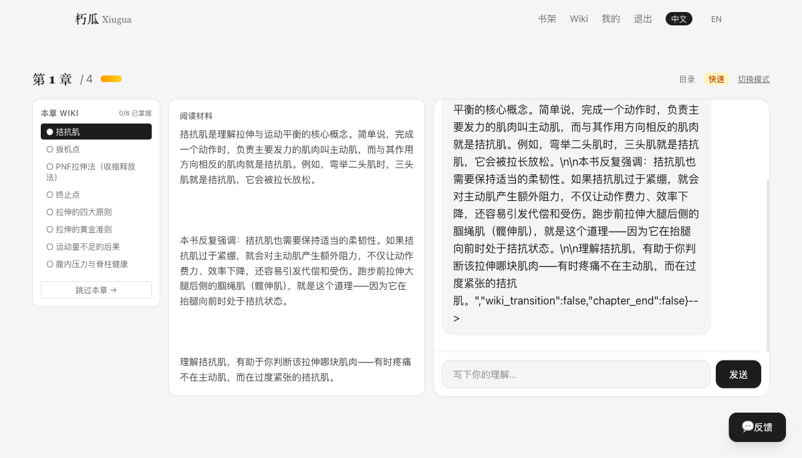

# 朽瓜 Xiugua — AI 苏格拉底式阅读

<p align="center">
  <strong>不是你看书，是 AI 带着你读。</strong><br/>
  苏格拉底式追问，逐章拆解。读过的每一本书，沉淀为你的个人 Wiki 知识库。
</p>

<p align="center">
  <a href="https://xiugua-reading.cn">xiugua-reading.cn</a>
</p>

---

## 这是什么

**朽瓜**是一个 AI 驱动的深度阅读工具。与你见过的所有 AI 阅读产品不同——不是你在问 AI，而是 **AI 像苏格拉底一样追着你问**。

每读完一章，AI 自动提取核心概念，追问、验证你的理解，直到你真正吃透为止。整本书读完后，留下的不是零散的笔记，而是一座**结构化、可检索、持续生长的个人 Wiki 知识库**。

理念来自于 Andrej Karpathy（前 Tesla AI 总监、OpenAI 联合创始人）提出的「LLM Wiki」：让 LLM 帮你持续构建与维护知识库，人类负责策展与提问，LLM 负责其余一切。

---

## 功能亮点

| 功能 | 说明 |
|---|---|
| **AI 主动追问** | AI 逐概念发起苏格拉底式对话，追问、验证、总结，而不是被动等你提问 |
| **双模式切换** | 快速模式 15 分钟掌握一章全貌；深度模式逐句精读，每概念 5+ 轮追问 |
| **Wiki 三色知识库** | 自动提取概念（琥珀）/ 观点（紫色）/ 案例（蓝色），可编辑、删除、筛选 |
| **多格式支持** | ePub / PDF（文字+扫描版）/ TXT，上传即自动解析章节 |
| **扫描版 PDF OCR** | PaddleOCR PP-StructureV3 逐区识别，多栏、表格、公式、插图全面处理 |
| **全书进度追踪** | 章节选择、阅读进度、连续阅读天数，一目了然 |
| **响应式三栏布局** | 左 Wiki 清单 + 中阅读材料 + 右 AI 对话，桌面端/移动端适配 |
| **中英双语** | 前端界面中英切换；AI 对话自动检测书语并协商语言偏好 |
| **安全防护** | JWT 认证 + 速率限制 + CSP + SQL 注入防护 + Prompt 注入防护 |
| **零停机部署** | git tag 触发 GitHub Actions，端口切换实现无缝更新 |

---

## 阅读流程

```
上传一本书  →  AI 预解析生成 Wiki  →  逐章对话阅读  →  Wiki 知识库沉淀
```

- **Step 1 — 上传书籍**：支持 ePub、PDF（文字/扫描）、TXT，上传后自动解析章节
- **Step 2 — AI 预解析 Wiki**：AI 自动识别核心概念、观点、案例，预生成 Wiki 条目
- **Step 3 — 逐章苏格拉底式对话**：AI 带你看一章、追问一轮，答对放行，不够深入继续追问
- **Step 4 — Wiki 知识库**：读完一本书，所有理解沉淀为结构化 Wiki，支持编辑、筛选

---

## 技术栈

| 层级 | 技术 |
|---|---|
| **前端** | Next.js 16 (App Router) + TypeScript + Tailwind CSS v4 |
| **后端** | Python FastAPI + SQLAlchemy async + Alembic |
| **数据库** | PostgreSQL |
| **大模型** | DeepSeek V4 Flash（1M 上下文窗口） |
| **OCR** | PaddleOCR PP-StructureV3 |
| **对象存储** | 腾讯云 COS |
| **部署** | 腾讯云 ECS（后端）+ Vercel（前端） |
| **CI/CD** | GitHub Actions |

---

## 项目结构

```
Xiugua-Reading/
├── backend/                 # FastAPI 后端
│   ├── app/
│   │   ├── main.py          # 应用入口
│   │   ├── config.py        # 配置管理
│   │   ├── database.py      # 数据库连接
│   │   ├── models/          # SQLAlchemy 模型
│   │   ├── routers/         # API 路由 (auth/books/reading/wiki/analytics)
│   │   ├── schemas/         # Pydantic 数据模型
│   │   ├── services/        # 业务逻辑层
│   │   └── utils/           # 工具函数
│   └── requirements.txt
├── web/                     # Next.js 16 前端
│   └── src/app/
│       ├── page.tsx         # 落地首页
│       ├── login/           # 邮箱登录
│       ├── register/        # 注册
│       ├── books/           # 书架管理
│       ├── read/[book_id]/  # 阅读页（三栏布局）
│       ├── wiki/            # Wiki 知识库
│       ├── profile/         # 个人中心
│       └── dashboard/       # 运营面板
├── miniapp/                 # 微信小程序
└── deploy.sh                # 零停机部署脚本
```

---

## 快速开始

### 后端

```bash
cd backend
conda activate xiugua
uvicorn app.main:app --host 127.0.0.1 --port 8000 --reload
```

### 前端

```bash
cd web
npm install
npm run dev          # → http://localhost:3000
```

---

## 截图

### 落地页


### 书架


### 阅读页


### AI 对话


---

## 许可

MIT License
