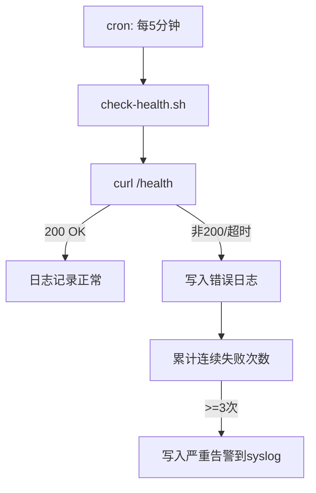

# Xiugua 监控告警方案

> 版本: v1.0 | 更新: 2026-05-07

---

## 1. Uptime 监控（免费，外部探测）

**推荐工具**: UptimeRobot (https://uptimerobot.com)

| 项目 | 配置 |
|------|------|
| 免费额度 | 5 个监控器，5 分钟间隔 |
| 监控端点 | `https://xiugua-reading.cn/health` |
| 预期响应 | HTTP 200，建议检测响应体中包含 `{"status":"ok"}` |
| 告警方式 | 邮件 / Slack / Telegram / SMS（付费） |

**配置步骤**:
1. 注册 UptimeRobot 账号
2. 创建 "HTTP(s)" 类型 Monitor
3. URL 填入 `https://xiugua-reading.cn/health`
4. 设置告警通知渠道（推荐 Slack Webhook 或邮件）
5. 启用 SSL 证书过期检测（同页面勾选 "Monitor SSL"）

**为什么用 /health 而不是首页**: `/health` 是轻量内部端点，不依赖数据库复杂查询，能准确反映服务进程状态。首页可能因静态资源加载、数据库缓存等因素产生假阳性或假阴性。

---

## 2. 服务器监控（腾讯云原生）

**工具**: 腾讯云云监控 (https://console.cloud.tencent.com/monitor)

云监控默认采集 CPU、内存、磁盘、网络等基础指标，无需额外安装 Agent。

### 推荐告警策略

| 指标 | 阈值 | 持续周期 | 严重程度 | 说明 |
|------|------|----------|----------|------|
| CPU 使用率 | > 80% | 5 分钟 | 警告 | 可能的流量高峰或进程异常 |
| CPU 使用率 | > 95% | 5 分钟 | 严重 | 严重过载，需立即处理 |
| 内存使用率 | > 90% | 5 分钟 | 警告 | 内存泄漏或配置不足 |
| 磁盘使用率 | > 85% | 10 分钟 | 警告 | 日志或数据文件堆积 |
| 磁盘使用率 | > 93% | 5 分钟 | 严重 | 磁盘即将写满，需紧急清理 |
| 出带宽 | > 200 Mbps | 5 分钟 | 警告 | 可能遭受攻击或流量异常 |

### 配置步骤
1. 进入云监控控制台 -> 告警策略 -> 新建策略
2. 关联 ECS 实例 `xiugua-ecs`
3. 按上述指标分别创建告警规则
4. 通知渠道：短信 + 邮件（腾讯云免费额度内）

---

## 3. 应用级监控（自建脚本 + cron）

脚本 `deploy/check-health.sh` 部署在服务器上，通过系统 crontab 每 5 分钟执行一次。

### 脚本工作原理



### 部署步骤

```bash
# 1. 将脚本复制到服务器
scp deploy/check-health.sh ubuntu@122.51.236.219:/opt/xiugua/scripts/check-health.sh

# 2. 设置可执行权限
ssh ubuntu@122.51.236.219 "chmod +x /opt/xiugua/scripts/check-health.sh"

# 3. 确保日志目录存在
ssh ubuntu@122.51.236.219 "mkdir -p /opt/xiugua/logs"

# 4. 添加 crontab 任务（每5分钟）
ssh ubuntu@122.51.236.219 'crontab -l 2>/dev/null; echo "*/5 * * * * /opt/xiugua/scripts/check-health.sh" | crontab -'
```

### 告警日志查看

```bash
# 查看健康检查日志
tail -f /opt/xiugua/logs/healthcheck.log

# 查看系统级告警
grep "HEALTH_CRITICAL" /var/log/syslog
```

### 补充：手动检查

```bash
# 从服务器本地检查
curl -s -o /dev/null -w "%{http_code}" http://127.0.0.1:8000/health

# 从外网检查
curl -s https://xiugua-reading.cn/health | jq .
```

---

## 4. LLM 成本监控

当前通过 DeepSeek V4 Flash API 调用，成本控制建议：

| 方式 | 说明 | 建议 |
|------|------|------|
| **API 用量面板** | DeepSeek 官方控制台提供实时用量 | 定期查看（建议每日） |
| **应用内汇总** | 在 `/debug/status` 端点添加 LLM 调用次数和 Token 消耗聚合 | 待开发，见下方建议 |
| **月度预算告警** | DeepSeek 平台可设置月消费上限 | 设置硬上限 $50/月 |

### 建议在 /debug/status 添加的字段

> 此项为建议，不改代码。如果后续开发，可在 `/debug/status` 端点增加以下统计：

```json
{
  "llm_usage": {
    "total_tokens_today": 1250000,
    "total_calls_today": 42,
    "estimated_cost_today": 0.63,
    "total_tokens_this_month": 18500000,
    "estimated_cost_this_month": 9.25,
    "budget_limit": 50.00
  }
}
```

实现方式：在每次 LLM 调用时，将 `model`、`prompt_tokens`、`completion_tokens`、`timestamp` 写入数据库表 `llm_usage`，在 `/debug/status` 中聚合查询即可。

---

## 5. 告警响应矩阵

| 告警来源 | 告警内容 | 响应动作 | 预期修复时间 |
|----------|----------|----------|-------------|
| UptimeRobot | 服务不可达 | SSH 登录检查 uvicorn 进程和 Nginx | 15 分钟 |
| 云监控 | CPU > 95% | 检查 `top`，排查异常进程或流量 | 30 分钟 |
| 云监控 | 磁盘 > 93% | 清理日志 (`/opt/xiugua/logs/`)、检查 PostgreSQL 日志 | 30 分钟 |
| check-health | 连续 3 次失败 | 自动重启服务 (`sudo systemctl restart xiugua`) | 5 分钟 |
| DeepSeek | 月消耗接近预算线 | 评估是否存在异常循环调用 | 按需 |

---

## 6. 告警升级流程

```
服务不可用
  ├─ 5分钟内恢复 → 无需升级
  ├─ 5-15分钟    → 主负责人收到告警
  └─ >15分钟     → 升级到项目负责人
                   告警渠道: 电话 / 企业微信 / Slack
```

---

## 附录 A: 监控方案对比

| 方案 | 覆盖范围 | 成本 | 维护成本 | 推荐度 |
|------|----------|------|----------|--------|
| UptimeRobot | 外部可达性 | 免费 | 极低 | 强烈推荐 |
| 腾讯云监控 | 服务器资源 | 免费（含 ECS） | 低 | 必选 |
| check-health.sh | 应用健康 | 免费 | 低（一次性配置） | 推荐 |
| Prometheus + Grafana | 全栈 | 高（需独立服务器） | 高 | 不推荐（当前阶段） |

> **结论**: Phase 1 采用上述前三项免费/低成本方案即可覆盖从 "外部可达性" 到 "服务器资源" 到 "应用进程" 的全链路监控。待用户量增长后，可考虑引入 Prometheus + Grafana 做更细粒度的指标采集。
